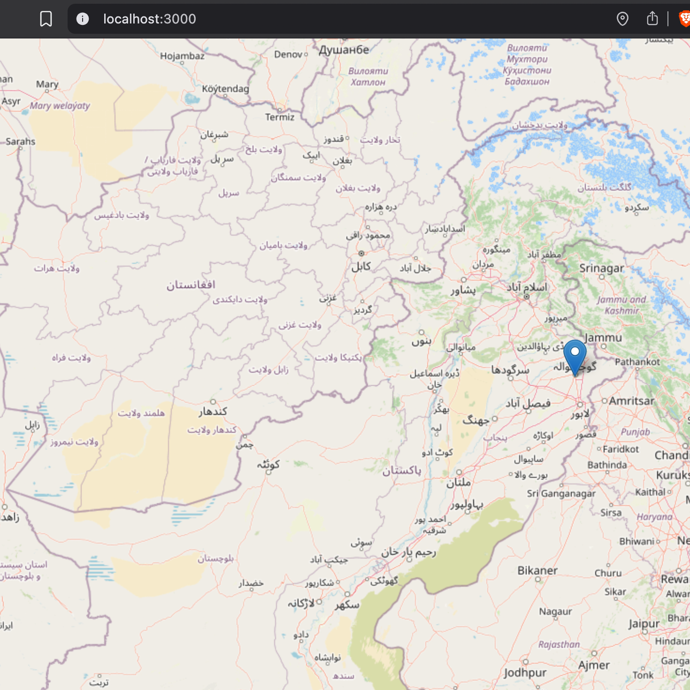

# Real-Time Location Tracker

A real-time location tracking web application that allows users to share their GPS location and visualize it on an interactive map. Built with Node.js, Express, Socket.IO, and Leaflet.js.



## Overview

This application provides real-time location tracking capabilities where users can:
- Share their current GPS location in real-time
- View their location on an interactive map powered by OpenStreetMap
- See multiple users' locations simultaneously (each user has a unique marker)
- Automatically update location as users move
- Remove markers when users disconnect

## Features

- **Real-Time Updates**: Uses WebSocket (Socket.IO) for instant location updates
- **GPS Tracking**: Leverages browser's Geolocation API with high accuracy
- **Interactive Map**: Leaflet.js integration with OpenStreetMap tiles
- **Multi-User Support**: Track multiple users simultaneously with unique markers
- **Auto-Centering**: Map automatically centers on the current user's location
- **Dynamic Markers**: Markers update in real-time as users move
- **Connection Management**: Automatically removes markers when users disconnect

## Technologies Used

### Backend
- **Node.js**: JavaScript runtime environment
- **Express.js** (v5.1.0): Web application framework
- **Socket.IO** (v4.8.1): Real-time bidirectional event-based communication
- **EJS** (v3.1.10): Embedded JavaScript templating engine

### Frontend
- **Leaflet.js** (v1.9.4): Open-source JavaScript library for mobile-friendly interactive maps
- **OpenStreetMap**: Free, editable map tiles
- **Browser Geolocation API**: Native browser API for location tracking
- **Socket.IO Client**: Real-time communication client

### Development Tools
- **Nodemon** (v3.1.11): Development server with auto-reload

## Installation

### Prerequisites
- Node.js (v14 or higher recommended)
- npm (Node Package Manager)

### Setup Steps

1. **Clone the repository**
   ```bash
   git clone <repository-url>
   cd real_time_tracker
   ```

2. **Install dependencies**
   ```bash
   npm install
   ```

3. **Start the server**
   ```bash
   npm start
   ```
   Or for development with auto-reload:
   ```bash
   npm run dev
   ```

4. **Access the application**
   - Open your browser and navigate to `http://localhost:3000`
   - Allow location permissions when prompted by your browser

## Usage

1. **Start the Server**: Run `npm start` or `npm run dev`
2. **Open Browser**: Navigate to `http://localhost:3000`
3. **Grant Permissions**: Allow the browser to access your location
4. **View Map**: Your location will appear as a blue marker on the map
5. **Real-Time Tracking**: The map will automatically update as you move
6. **Multiple Users**: Open multiple browser tabs/windows to see multiple users tracked simultaneously

## Technical Documentation

### Architecture

The application follows a client-server architecture with real-time bidirectional communication:

```
Client (Browser)          Server (Node.js)
     |                           |
     |--- Geolocation API --->   |
     |                           |
     |--- Socket.IO --->         |
     |                           |
     |<-- Location Updates ---   |
     |                           |
     |--- Map Rendering --->     |
```

### Project Structure

```
real_time_tracker/
├── app.js                 # Main server file with Express and Socket.IO setup
├── package.json           # Project dependencies and scripts
├── views/
│   └── index.ejs         # Main HTML template
├── public/
│   ├── css/
│   │   └── style.css     # Map styling
│   └── js/
│       └── script.js     # Client-side logic (geolocation, map, socket)
├── images/
│   └── screenshot.png    # Application screenshot
└── README.md             # This file
```

### Key Components

#### Server (`app.js`)

- **Express Server**: Serves static files and renders the main page
- **Socket.IO Server**: Handles WebSocket connections
- **Event Handlers**:
  - `connection`: New client connects
  - `send-location`: Receives location data from clients
  - `receive-location`: Broadcasts location to all connected clients
  - `disconnect`: Handles client disconnection

```12:22:app.js
io.on("connection", (socket) => {
  socket.on("send-location", (data) => {
    console.log(data);
    io.emit("receive-location", { id: socket.id, ...data });
  });
  socket.on("disconnect", () => {
    io.emit("user-disconnected", socket.id);
  });
});
```

#### Client (`public/js/script.js`)

- **Geolocation Tracking**: Uses `navigator.geolocation.watchPosition()` to continuously track user location
- **Map Initialization**: Creates a Leaflet map instance with OpenStreetMap tiles
- **Marker Management**: Creates, updates, and removes markers for each connected user
- **Socket Events**:
  - `send-location`: Sends current GPS coordinates to server
  - `receive-location`: Receives location updates and updates map markers
  - `user-disconnected`: Removes markers when users disconnect

```3:14:public/js/script.js
if (navigator.geolocation) {
  navigator.geolocation.watchPosition(
    (position) => {
      const { latitude, longitude } = position.coords;
      socket.emit("send-location", { latitude, longitude });
    },
    (error) => {
      console.error(error);
    },
    { enableHighAccuracy: true, timeout: 5000, maximumAge: 0 }
  );
}
```

### Data Flow

1. **Location Capture**: Browser's Geolocation API captures user's GPS coordinates
2. **Emit to Server**: Client sends location data via Socket.IO `send-location` event
3. **Server Broadcast**: Server receives location and broadcasts to all connected clients via `receive-location` event
4. **Map Update**: Each client receives the broadcast and updates the map marker
5. **Auto-Center**: The map centers on the current user's own location

### Geolocation Configuration

The application uses the following geolocation options:
- `enableHighAccuracy: true`: Requests high-accuracy GPS positioning
- `timeout: 5000`: 5-second timeout for location requests
- `maximumAge: 0`: Always fetch fresh location data (no caching)

### Socket.IO Events

| Event | Direction | Description |
|-------|-----------|-------------|
| `send-location` | Client → Server | Client sends current location coordinates |
| `receive-location` | Server → All Clients | Server broadcasts location update with user ID |
| `user-disconnected` | Server → All Clients | Notifies when a user disconnects |

### Map Features

- **Tile Provider**: OpenStreetMap (free, open-source map tiles)
- **Initial View**: Centered at [0, 0] with zoom level 13
- **Marker Style**: Default Leaflet blue teardrop marker
- **Auto-Animation**: Smooth map transitions when centering on user location

## Browser Compatibility

- **Geolocation API**: Supported in all modern browsers (Chrome, Firefox, Safari, Edge)
- **HTTPS Requirement**: For production, HTTPS is required for geolocation API (localhost works for development)
- **WebSocket Support**: Socket.IO falls back to polling if WebSockets are unavailable

## Security Considerations

- **HTTPS**: Required for geolocation in production environments
- **CORS**: Currently allows all origins (consider restricting for production)
- **Input Validation**: Location data should be validated before broadcasting

## Future Enhancements

Potential improvements for the application:
- User authentication and identification
- Location history and path tracking
- Custom marker icons for different users
- Geofencing and location-based alerts
- Privacy controls (opt-in/opt-out)
- Database storage for location history
- RESTful API for location data retrieval

## Credits & Acknowledgments

This project was developed following a tutorial that provided excellent guidance on implementing real-time location tracking with Socket.IO and Leaflet.js.

**Special thanks to the tutorial creator:**
- [Real-Time Location Tracker Tutorial](https://www.youtube.com/watch?v=JmpDGMgRFfo) - YouTube tutorial that served as the foundation for this project

We are grateful for the clear explanations and step-by-step instructions that made building this application possible.

## License

ISC

## Author

Created as a real-time location tracking demonstration project.

